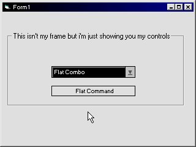



## Flat Controls

### Description

These is an easy way to create your own ocx controls. Has a Flat Command and a Flat Combo Box

you could use it to your advantage and create your own flat controls, and i'll be updating this as soon as i finish the flat scroll bar, check box, option button, and frame..
 
### More Info
 

             |
---                |---
**Submitted On**   |2002-04-07 00:23:06
**By**             |[Cemetery](https://github.com/Planet-Source-Code/PSCIndex/blob/master/ByAuthor/cemetery.md)
**Level**          |Beginner
**User Rating**    |3.8 (23 globes from 6 users)
**Compatibility**  |VB 5\.0, VB 6\.0
**Category**       |[Custom Controls/ Forms/  Menus](https://github.com/Planet-Source-Code/PSCIndex/blob/master/ByCategory/custom-controls-forms-menus__1-4.md)
**World**          |[Visual Basic](https://github.com/Planet-Source-Code/PSCIndex/blob/master/ByWorld/visual-basic.md)
**Archive File**   |[Flat\_Contr69641472002\.zip](https://github.com/Planet-Source-Code/cemetery-flat-controls__1-33554/archive/master.zip)

